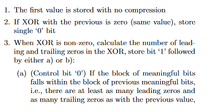
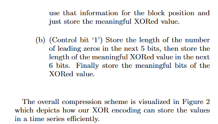
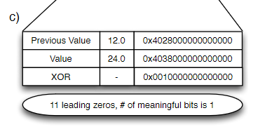
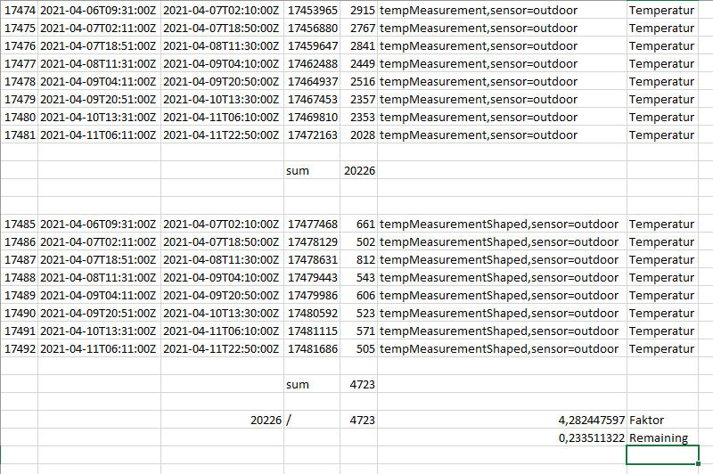
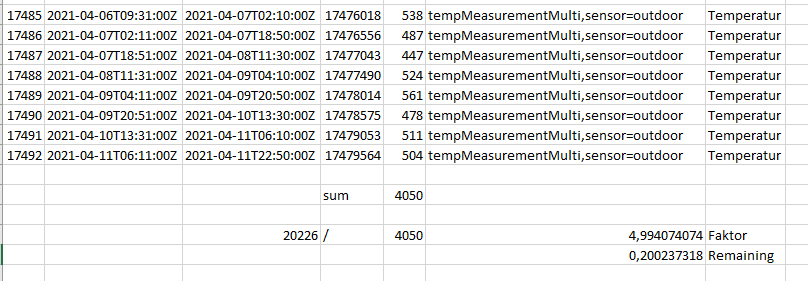
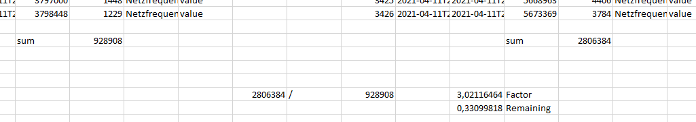

# Bonobo: Improved Gorilla algorithm for time series databases


From https://www.vldb.org/pvldb/vol8/p1816-teller.pdf p. 5 f.




Figure 2:

 

In this example this works great, because only 1 bit changes. 

When you have data like Temperature, Humidity and so on you have data in the range of one to two decimal places.

Let’s have a temperature sensor that stores all the data from 10.0 °C to 11.0 °C in a row.
So, 10 is in 32 bit float: 
0b01000001001000000000000000000000 
see https://www.h-schmidt.net/FloatConverter/IEEE754.html

In all example 32-bit floats are used while in systems like InfluxDB 64 bit floats are used.


10.1 is in float, actually it is stored as 10.1000003814697265625 because in binary system 10.1 can’t be represented directly. Leading to 
0x01000001001000011001100110011010

```
0b01000001001000000000000000000000
XOR
0b01000001001000011001100110011010
----------------------------------
0b00000000000000011001100110011010
```

This leads to a change of 9 Bits

However, if we know that our temperature sensor reports only data with 1 decimal place precision, we can store the value as 10.125, which is rounded to 1 decimal place resulting in 10.1.

```
0b01000001001000100000000000000000 (10.125)
XOR
0b01000001001000000000000000000000 (10.0)
----------------------------------
0b00000000000000100000000000000000
```

So only one bit has changed when storing 10.1 as 10.125 and a change to 10.0 happens.

Case when it changes from 10.1 to 10.2
```
0b01000001001000011001100110011010 (10.1)
0b01000001001000110011001100110011 (10.2)
----------------------------------
0b00000000000000101010101010101001 (XORed)
```
Again 9 Bits are used when data is stored unchanged.

So, I’ve made a lookup table, because I’m not that into math to find a formula for calculating fitting values.
```
		0 -> 0
		0.1 -> 0.125
		0.2 -> 0.1875
		0.3 -> 0.3125
		0.4 -> 0.4375
		0.5 -> 0.5
		0.6 -> 0.625
		0.7 -> 0.6875
		0.8 -> 0.8125
		0.9 -> 0.9375
```

Take 10.1 to 10.6 because Temperature doesn’t change step by step
```
0b01000001001000011001100110011010 (10.1)
0b01000001001010011001100110011010 (10.6)
----------------------------------
0b00000000000010000000000000000000
```
So in this case also only 1 bit is used

So how behaves this value shaping?
```
0b01000001001000100000000000000000 (10.125)
0b01000001001010100000000000000000 (10.625)
----------------------------------
0b00000000000010000000000000000000 
```
So also only 1 bit is used. So compared to unshaped data there is not more space used with delta / Gorilla compression.

Using real word data from a temperature sensor outside with one decimal place gives about 4,3 times less spaced used with shaped values or only about 23 % used space compared to unshaped values. Also other values gave about only one fifth of used space compared to unshaped values.


 
You can also do that with 2 decimal places but the table gets really big.

```
		0.01 ->  0.0078125
		0.02 ->  0.0234375
		0.03 ->  0.03125
		0.04 ->  0.0390625
		0.05 ->  0.0546875
		0.06 ->  0.0625
		0.07 ->  0.0703125
		0.08 ->  0.078125
		0.09 ->  0.09375
		0.1 ->  0.1015625
		0.11 ->  0.109375
		0.12 ->  0.1171875
		0.13 ->  0.1328125
		0.14 ->  0.140625
		0.15 ->  0.1484375
		0.16 ->  0.1640625
		0.17 ->  0.171875
		0.18 ->  0.1796875
		0.19 ->  0.1875
		0.2 ->  0.203125
		0.21 ->  0.2109375
		0.22 ->  0.21875
		0.23 ->  0.234375
		0.24 ->  0.2421875
		0.25 ->  0.25
		0.26 ->  0.2578125
		0.27 ->  0.2734375
		0.28 ->  0.28125
		0.29 ->  0.2890625
		0.3 ->  0.3046875
		0.31 ->  0.3125
		0.32 ->  0.3203125
		0.33 ->  0.328125
		0.34 ->  0.34375
		0.35 ->  0.3515625
		0.36 ->  0.359375
		0.37 ->  0.3671875
		0.38 ->  0.3828125
		0.39 ->  0.390625
		0.4 ->  0.3984375
		0.41 ->  0.4140625
		0.42 ->  0.421875
		0.43 ->  0.4296875
		0.44 ->  0.4375
		0.45 ->  0.453125
		0.46 ->  0.4609375
		0.47 ->  0.46875
		0.48 ->  0.484375
		0.49 ->  0.4921875
		0.5 ->  0.5
		0.51 ->  0.5078125
		0.52 ->  0.5234375
		0.53 ->  0.53125
		0.54 ->  0.5390625
		0.55 ->  0.5546875
		0.56 ->  0.5625
		0.57 ->  0.5703125
		0.58 ->  0.578125
		0.59 ->  0.59375
		0.6 ->  0.6015625
		0.61 ->  0.609375
		0.62 ->  0.6171875
		0.63 ->  0.6328125
		0.64 ->  0.640625
		0.65 ->  0.6484375
		0.66 ->  0.6640625
		0.67 ->  0.671875
		0.68 ->  0.6796875
		0.69 ->  0.6875
		0.7 ->  0.703125
		0.71 ->  0.7109375
		0.72 ->  0.71875
		0.73 ->  0.734375
		0.74 ->  0.7421875
		0.75 ->  0.75
		0.76 ->  0.7578125
		0.77 ->  0.7734375
		0.78 ->  0.78125
		0.79 ->  0.7890625
		0.8 ->  0.8046875
		0.81 ->  0.8125
		0.82 ->  0.8203125
		0.83 ->  0.828125
		0.84 ->  0.84375
		0.85 ->  0.8515625
		0.86 ->  0.859375
		0.87 ->  0.8671875
		0.88 ->  0.8828125
		0.89 ->  0.890625
		0.9 ->  0.8984375
		0.91 ->  0.9140625
		0.92 ->  0.921875
		0.93 ->  0.9296875
		0.94 ->  0.9375
		0.95 ->  0.953125
		0.96 ->  0.9609375
		0.97 ->  0.96875
		0.98 ->  0.984375
		0.99 ->  0.9921875
		1 ->  1
```

Perhaps this is even possible to store 3 digits. 
Via that method you can shape your existing data saving a lot of space.


However there is an even better method: Multiply the values so that there is no decimal place left. 
If you setup a new measurement you should really consider this.


 

This reduces the needed storage by a factor of 5. That makes a huge difference.
Using this in influxdb could increase compression a lot. 

However, we now want to put this together in an algorithm, the Bonobo algorithm, which shapes data that way that Gorilla algorithm can compress it to smaller size.

There are now a few more possibilities:
1. If your data is in very limited ranges like temperature data you could always multiply it with let’s say 10^9 giving 9 decimal places with can be stored very efficiently. This looks like just storing integers, but with integers systems like InfluxDB use another compression algorithm which is far less efficient then Gorilla Algorithm and 64 Bit Integers support a maximum value of 2^64 whereas 64-Bit floats (=double) supports about 1.8 x 10^308 (but with the price of a limited accuracy), see https://stackoverflow.com/questions/1848700/biggest-integer-that-can-be-stored-in-a-double
2. If your numbers get really high and in a wide range and you need dynamic multiplication you could store another byte representing the exponent of multiplication. So 0 -> 10^0, 1 10^1 and so on. This byte can also be compressed by gorilla algorithm by appending them to the float value and XORing them together. Only when number of decimal places increases then also exponent of multiplication increases. The exponent of multiplication only decreases when number would get too high. So in our float example of above:

Value to be stored: 10.187 with value followed 10

Stored as: 10187 and stored 3 in the extra Byte representing multiplication by 10^3 
```
0b01000110000111110010110000000000|00000011 (10187)
0b01000110000111000100000000000000|00000011 (10000)
-------------------------------------------
0b00000000000000110110110000000000|00000000
```

In this case only 6 bits changed, that have to be stored. With untreated values 13 Bits changed
```
0b01000001001000000000000000000000 (10)
0b01000001001000101111110111110100 (10.187)
----------------------------------
0b00000000000000101111110111110100
```
And of course when retrieving the data a division is done to get the same data back that was put into the database.

Since this algorithm is not yet implemented in influxDB I use value shaping a lot. Recently I’ve converted one large measurement and DB usage dropped from 1,1 GB to 677 MB. 

For the period of one weak storage usage is about one third for storing the net frequency of the European power grid.


 
The values on the left are multiplied by 10^6 to have no decimal places. Values on the right were stored "as they were" with 3 decimal places.

I hope this Bonobo algorithm can be implemented in influxdb to save even more space.

This algorithm is published under Attribution-ShareAlike 4.0 International (CC BY-SA 4.0) https://creativecommons.org/licenses/by-sa/4.0/

Please link to this Github-Page and name the author by "JSBergbau"

<a rel="license" href="http://creativecommons.org/licenses/by-sa/4.0/"></a><br />This work is licensed under a <a rel="license" href="http://creativecommons.org/licenses/by-sa/4.0/">Creative Commons Attribution-ShareAlike 4.0 International License</a>.
